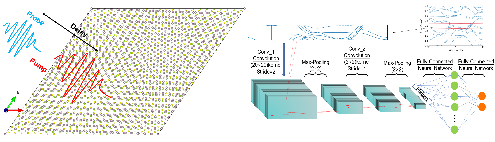

Hi there! I am Jiaxuan Guo, a fourth-year student majoring in Physics at Fudan University in China. My research interests lie in computational physics and materials science, especially by means of **first-principles calculations** and **machine learning**.

### Research Topics
+ *Ab Initio* Methods for Electronic and Optical Properties of Real Materials
+ Twisted 2D Bilayer Materials
+ Artificial Intelligence for Science (Physics, Material Science)

{:height="60%" width="66%"}

### Experience
+ **First-Principles Study of Time-Resolved ARPES on t-MoSe2/WS2 Bilayer**

Supervised by **Prof. Diana Qiu**
